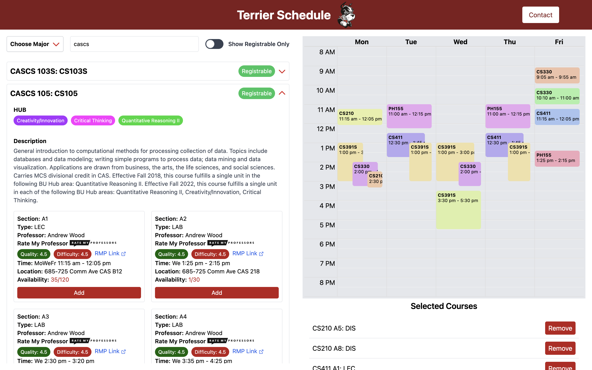

# Terrier Schedule



Terrier Schedule is a web application designed to help Boston University students plan their course schedules efficiently. Currently have 500 users.

## Features

- Browse available courses
- View detailed course information
- Add courses to your schedule
- Rate My Professor quality and difficulty for all professors
- HUB tags for all courses
- Visualize your weekly schedule
- Filter courses by major, course number, and other criteria

## Technologies Used

- Frontend: React
- Backend: Django
- Database: PostgreSQL

<!-- ## Getting Started -->
<!--
### Prerequisites

- Node.js (v14 or later)
- Python (v3.8 or later)
- PostgreSQL -->

<!--
### Installation

1. Clone the repository:
   ```
   git clone https://github.com/your-username/terrier-schedule.git
   cd terrier-schedule
   ```

2. Set up the backend:
   ```
   cd backend
   python -m venv venv
   source venv/bin/activate  # On Windows use `venv\Scripts\activate`
   pip install -r requirements.txt
   python manage.py migrate
   ```

3. Set up the frontend:
   ```
   cd ../frontend
   npm install
   ```

### Running the Application

1. Start the backend server:
   ```
   cd backend
   python manage.py runserver
   ```

2. In a new terminal, start the frontend development server:
   ```
   cd frontend
   npm start
   ```

3. Open your browser and navigate to `http://localhost:3000` -->

## Contributing

We welcome contributions to Terrier Schedule! If you have suggestions for improvements or bug fixes, please feel free to create a pull request or open an issue on our GitHub repository.
Contact
For any questions, feedback, or if you'd like to contribute, please contact:

Email: amyat@bu.edu

## Contact

For any questions or feedback, please contact us at [amyat@bu.edu](amyat@bu.edu).

## Upcoming Feature

- Rating system for classes
- Dorm rating
